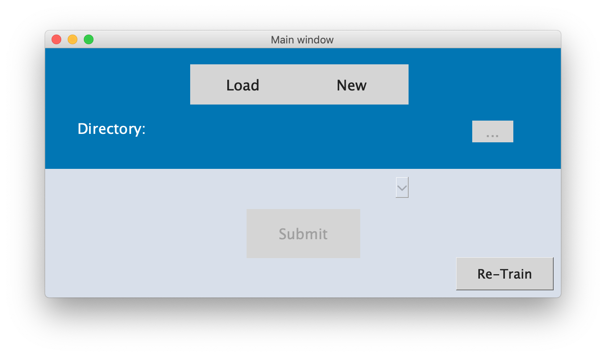
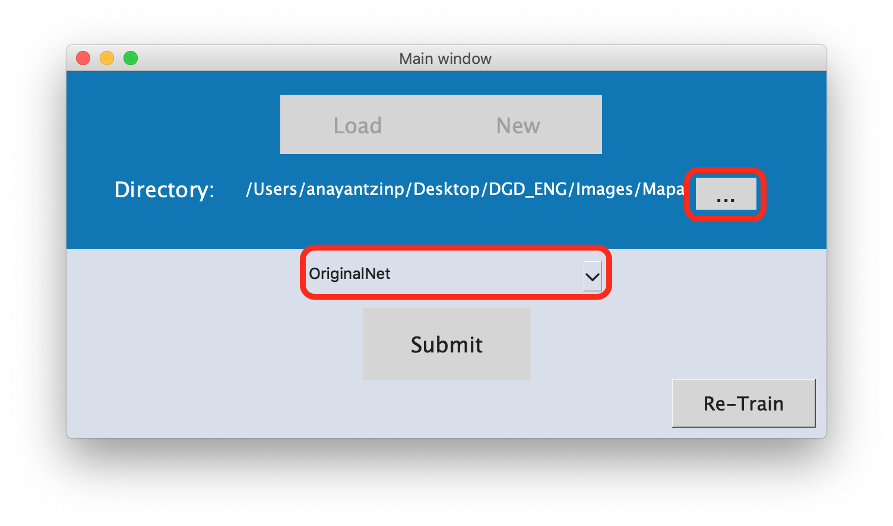
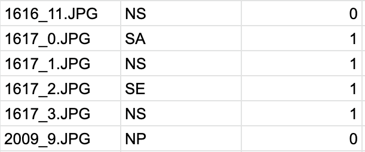
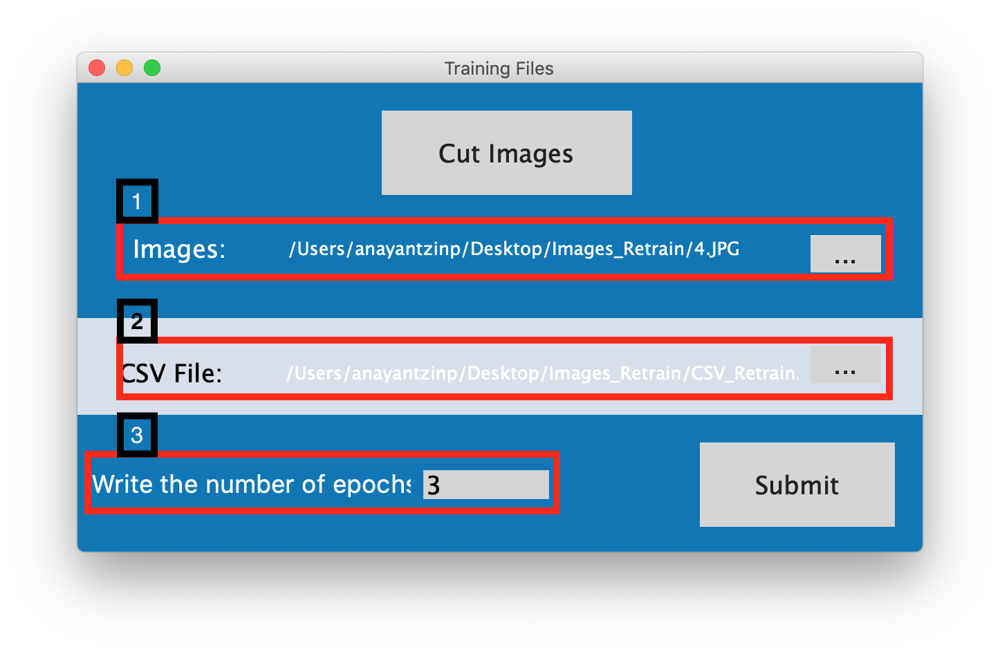
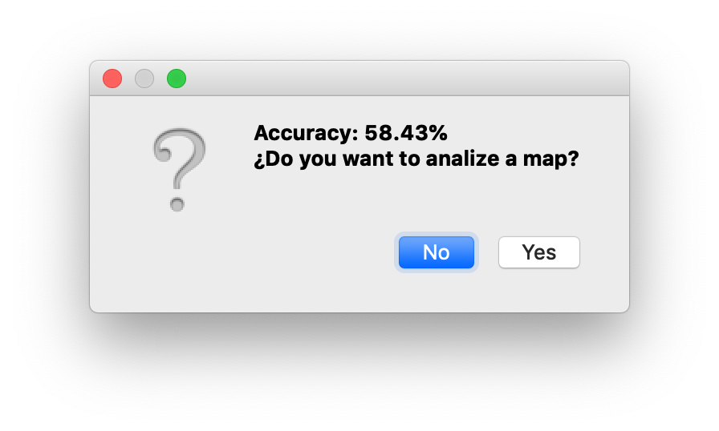

# Deep Green Diagnostics
----------------------------
# Readme

## Description
System designed to analyze the health of the vegetation of urban areas through a UAV.

## Software requirements
### Operating System
* MacOSX 10.12.0 - 10.14.0
* Linux Ubuntu 16.04 LTS
* Windows 10

### Software needed
* python 3.6
* Anaconda2-5.2.0
* Tensorflow 1.8.0

It is recommended to create a virtual environment in Anaconda before installing the packages listed below.

_To create an enviroment_

In the terminal client enter the following:

`conda create -n yourenvname python=3.6 anaconda`

_To activate your virtual enviroment on Linux/MacOS_

`source activate yourenvname`

_To activate your virtual enviroment on Windows_

`activate yourenvname`

__Use the package manager pip to install the modules below.__

`pip install name_module`

__name_module:__

* jupyter
* numpy*
* Pillow
* beautifulSoap4
* glob3
* selenium
* secrets*
* pyqt5
* QtWebKitWidgets for Linux/MacOSX
* QtWebEngineWidgets for Windows
* matplotlib

*In some cases those modules are already installed.

If you want to search for one of them or look for the packages already installed.

`conda search name_module` or 
`conda list`

__Use the package manager conda to install scikit-learn__

`conda install -n yourenvname scikit-learn`

## Hardware requirements

- UAV of the DJI family with a 12 megapixel camera.
(The most recommended is the drone phantom 4 or higher).

If the software runs on a computer with _MacOS_ operating system:

| RAM        | CPU           | Storage  |
| ------------- |:-------------:| -----:|
| 8 GB or more| Intel Core i5 or higher| 15GB or more |

If the software runs on a computer with _Linux or Windows_ operating system:

| RAM        | CPU           | Storage  |
| ------------- |:-------------:| -----:|
| 12 GB or more| Intel Core i7 or higher| 15GB or more |

__Note:__ If your computer doesn't have enough RAM you should try to go to the network code and change the size of the batch that the network receives in the propagation. The current size of the batch is __300__ as you can see in the line 2 of the code below.

```python
for k,v in self.dicc_pos.items():
     clase_arquitectura = TT_modelo_RNC30(300,
                self.directorio
                +'pickle/pickle_'+str(k),
                self.path_pesos)
         l = clase_arquitectura.propagacion(self.currentDir)
                self.dic_aux[k] = list(l[0])
                self.etiquetas.append(list(l[0]))
                del clase_arquitectura

```

If you want the changes to work you need to change the _for_ cycle that the function has above.

You can find the complete code in this path:
 
 `./DGD_ENG⁩/View⁩/VistaInicio.py`

## Usage
For a quick start follow the steps below and watch the video.

__Step 1:__ Take the photos with the drone and the [Pix4D capture©](https://www.pix4d.com/product/pix4dcapture)  application.

__Step 2:__ Download the zip file and open the main directory with the name __DGD_ENG__.

__Step 3:__ You'll see next directories tree.

- /DGD_ENG
 - TT\_cultivos_main.py
 - readme.txt
 - chromedriver
 - /Images**
     - ParqueBicentenarioMAPA2\_20180610134929
     - Mapa1ESCOM\_20180428121951
     - Mapa1\_20180520122028
     - EstacionamientoESCOM\_20180524105606
 - /View
 - /Model
      - /Nets
      - /OriginalNet
      - /Pickles


_**In this directory put the images from the drone._

** __IMPORTANT!__
_Create a new directory for each new project._

_**The content of this directory are examples of the system._ 

__Step 4:__ Open a terminal in your operating system
and look for the DGD directory with cd command.

	cd /Users/userDGD/Desktop/DGD/

__Step 5:__ Execute the script TT\_cultivos_main.py 

	python TT_cultivos_main.py
	
You'll see the main window 

### New
Choose the option __New__ when you've never done an analysis with your images, this option will propagate the images in the neural network and it will take around 20 minutes for each 30 images.

Remember that if you want to analize a new map you must copy your photos in a new directory within the _Images_ directory.

Then you can choose the photos and the neural network with which you want to analyze the map.


### Load
Choose the option __Load__ when you have a previous analysis and the file with extension .p.

In the ZIP file is a directory with some examples maps that you can try with the __load__ option.

### Retrain
Choose the option __Re-train__ when you want to improve the accuracy of the neural network with your own drone images.


#### Prepare the dataset

The input images for training must be of size 200 x 200 pixels and they must be in .JPG format as well.
If you don't have the pieces of the image, press the _Cut Images_ button to prepare your images. The system will cut the image of 12,000 pixels in 300 pieces and it will rename them.

When your images are ready the system will close and you will have to tagg the amount you want to be used to retrain the neural network.

Then you'll have to prepare the CSV file as follow:
 
- In the first column the name of the image is written.
- In the second column the tag of the class (see the section __About the neural network__ for more information).
- In the third column a label _1_ is placed if in the photograph there's contamination or _0_ if there's no contamination. We consider the contamination as all the garbage that could be found in an urban environment, such as waste of food, empty containers of sweets or chips, plastic bottles, and other things.

The example of how the CSV file is to be seen is shown below.
 
 

#### Dataset ready

If you have the images in a directory with the correct size  and __all of them with their tags__ continue with the next steps and see the image below:

1. Choose the directory with your images wherever it is 
2. Choose the CSV file.
3. Write the number of iteration for the network.

When you press the submit button, the system will separate the images in two sets, one for retraining and another for testing.



Wait for the system and finally you'll see a window like this:



The current accuracy is __72.03%__

## About the neural network
In this project, we use a neural network with __5__ convolutional layers to extract characteristics and __4__ classification layers. To access the files that contain the neural network, follow this path:

	cd DGD_ENG/Model/TT_modelo_RNC30.py
	
### Classes

The buttons shown in the map view represent each of the classes separated by colors, the next are exmples of each class.


If you want to tag your own dataset follow the examples above and place the labels in the CSV file as shown in the following table.

| Name of the label| Description          |
| -----------------|:--------------------:|
| SA               | Healthy (H)          |
| SE               | Dry (D)              |
| NS               | Unhealthy (UNH)      |
| NP               | No Vegetation (NV)  |

To indicate __contamination__ write a number __1__ for contamination and __0__ for no contamination.


## Troubleshoot

__Images without metadata:__ If the images don't have metadata, the system won't be able to analyze them, the system use specific data to work. Those are the _GPS information_, the _RelativeAltitud_ and the _FlightYawDegree_ to construct the map.

__Non-square maps:__ If your drone didn't finish the flight and the map is incomplete, we recommend to repeat the operation because a non square map causes loss of information and makes the algorithm to create the map put the output labels in wrong places.

__Press any button on the map view and the images don't appear:__ This may happen because the images aren't in the "Images" directory, find the project and copy it in the right directory.

__Load a map and the images don't appear:__ This may happen because the images aren't in the "Images" directory, find the project and copy it in the right directory. Another reason could be because the name of the directory is wrong, the system rename the directory of your project with an ID according to the date. In that case it is recommended that you analize the map again.

__The accuracy of the network doesn't increase:__ You should take care of the data that you use for feed the neural network, try to follow the examples in the section __About of the neural network__. 
You can try increasing the value of the number of the epoch. It is very important that you follow the labels as shown in the past examples.

## Contact

For any questions about the system and problem solving

- Anayantzin Paola López Juárez....... anayantzinp9503@gmail.com

- Israel Agustin Vargas Monroy....vargasmonroyisraelagustin@gmail.com 
